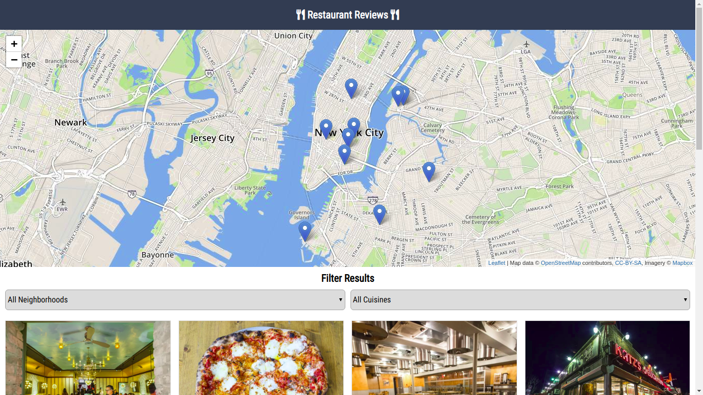
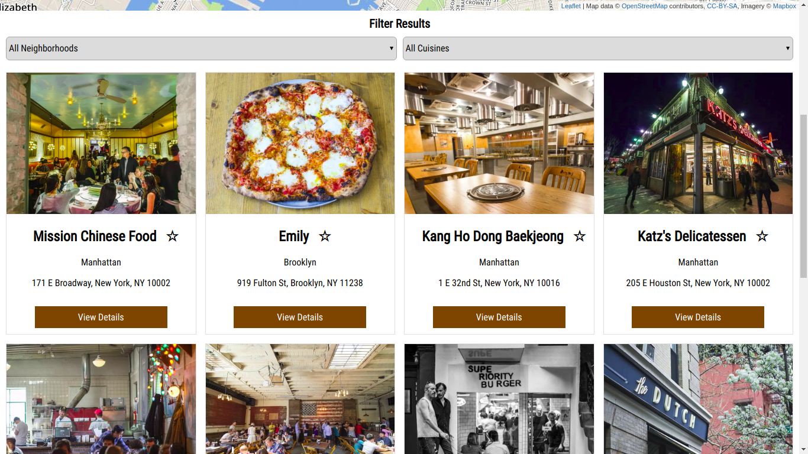

# Restaurant Reviews Stage 3

An offline-first, PWA, Restaurant Reviews app.Udacity Mobile Web Specialist Nanodegree program, 3-parts project. 

## Getting Started

These instructions will get you a copy of the project up and running on your local machine for development and testing purposes.

### Prerequisites

- [skarthikeyan96/mws-restaurant-stage-3](https://gitlab.com/arrow_996/mws-restaurant-stage-3)

### Installing

1. Download the [server](https://gitlab.com/arrow_996/mws-restaurant-stage-3)
2. install the dependencies using `npm install`
3. Start server by running `node app.js` on root folder of server.
3. Download this repo.
4. Use WebServer for Chrome or Start python2 server by running `python -m SimpleHTTPServer 8080` on project root folder.
5. Navigate to `localhost:8080` to view the app.

### Screenshots

